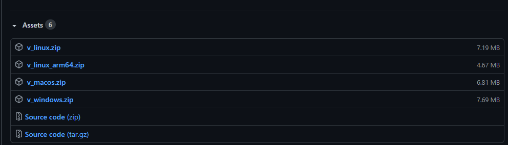
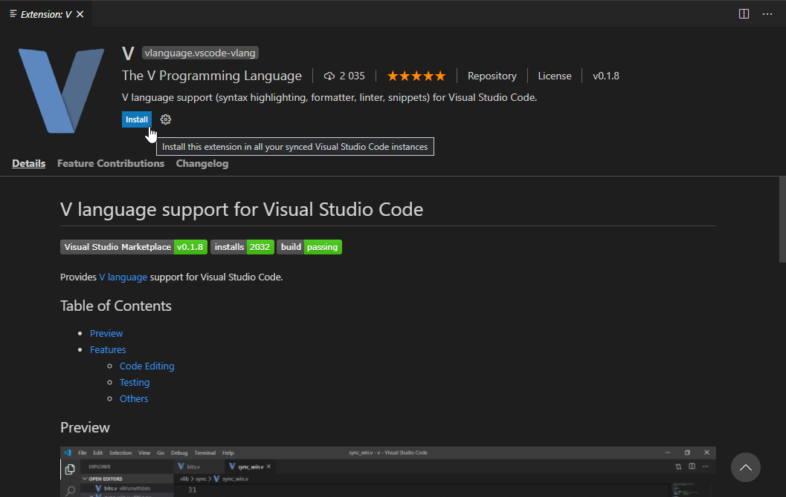

Для работы нам потребуется компилятор языка и редактор кода (IDE -  *Integrated development environment*).

### Установка компилятора

Для установки компилятора языка V, перейдем на GitHub страницу релизов

https://github.com/vlang/v/releases

 и выберем версию, в зависимости от нашей системы:



Соответственно, 

если у вас система **Windows**, выбираем `v_windows.zip`

если у вас система **Linux**, выбираем `v_linux.zip`

если у вас система **Mac**, выбираем `v_macos.zip`

Распаковываем архив в удобное для вас место, далее:

1. Открываем данную папку в консоли (если у вас Windows 10, с зажатой клавишей Shift нажмите на пустую область в папке и выберите в меню пункт "Открыть PowerShell здесь")

2. Выполните команду

   ```shell
   v symlink
   ```

   Теперь мы можем компилировать/запускать V файлы без необходимости прописывать полный путь к компилятору
   
3. Чтобы убедиться, что все сконфигурировано верно, перейдем в любую другую директорию, например, выполним команду 

   

   ```shell
   cd ..
   ```

4. Выполним 

   ```shell
   v version
   ```

   На что мы должны получить вывод в виде версии языка V, например

   ```shell
   > V 0.2.2 4e6a19b
   ```

   *актуальна на момент написания статьи*

### V IDE

Рекомендую использовать Visual Studio Code c плагином языка V

1. Если еще не скачана IDE, вы можете скачать её по ссылке -

https://code.visualstudio.com/

2. Далее устанавливаем плагин языка V -

https://marketplace.visualstudio.com/items?itemName=vlanguage.vscode-vlang



3. Для комфортной работы, включим VLS - позволит нам получать более полезные подсказки от IDE

   Итак, перейдем в настройки расширения (нажав на шестеренку)


Поставим галочку


Все, первоначальная настройках среды завершена, теперь мы можем приступать программированию на языке V! :D

дальше - жестче
:))

